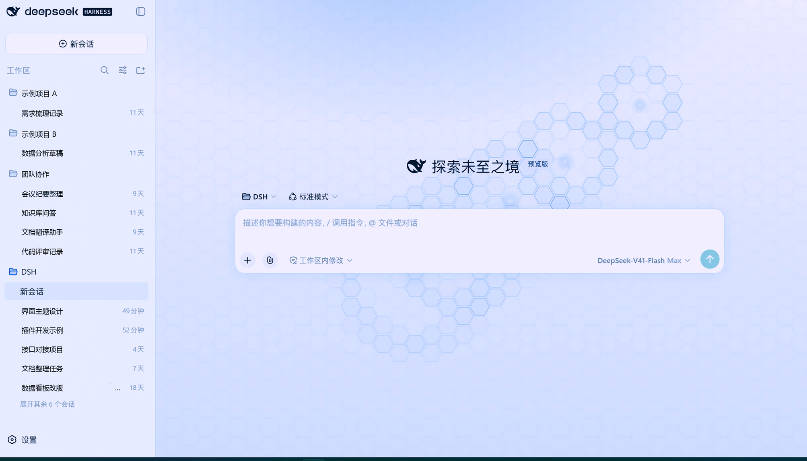
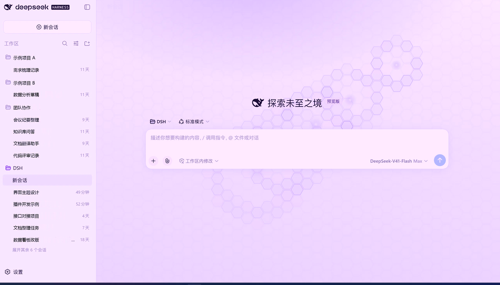
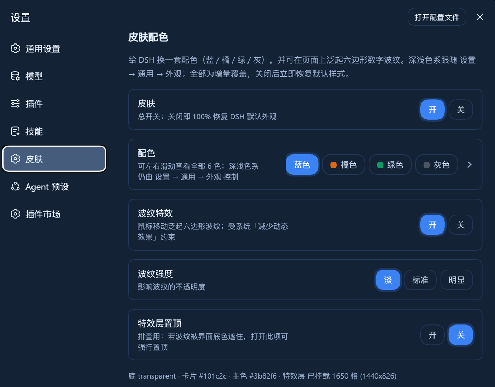
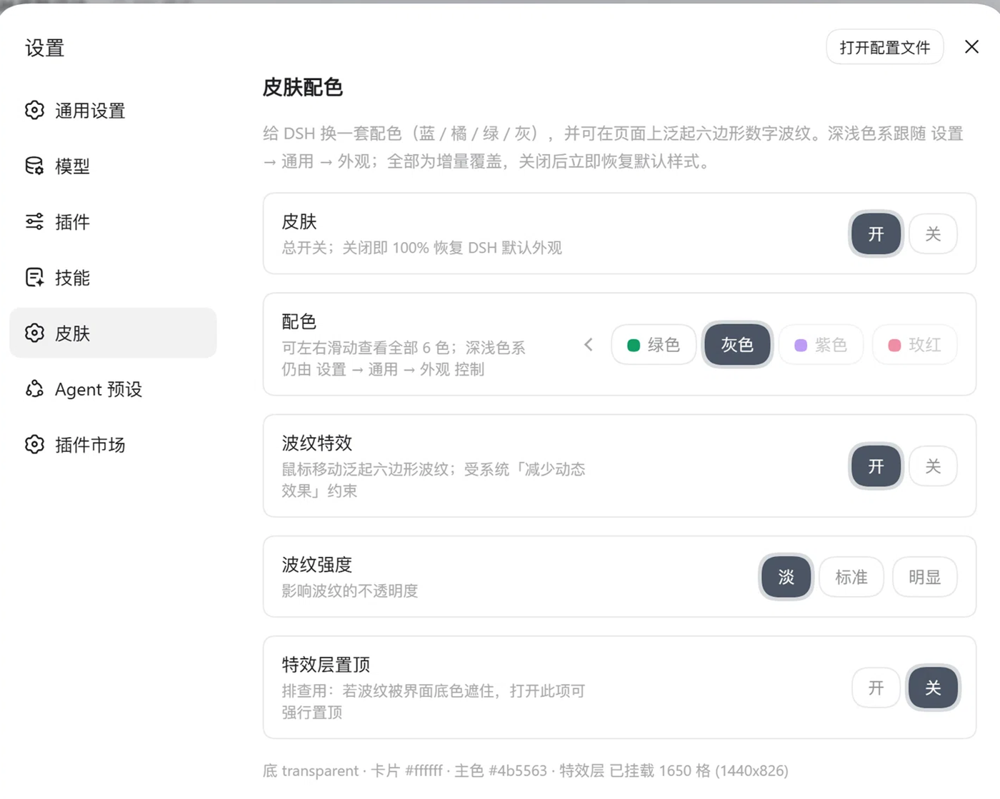

# dsh-ui-skin-wave

[中文](README.md) | **English**

A **skin plugin** for the DSH Web GUI: six palettes (blue / orange / green / gray / purple / rose)
in both light and dark, plus a toggleable **hexagonal ripple** effect that follows your mouse.

- Fully **additive**: one style tag, one effect-layer div, three body attributes.
  Switching it off restores the stock DSH look exactly.
- Touches no upstream DSH file, so DSH upgrades never overwrite it.
- Light/dark follows DSH's own Settings -> General -> Appearance; the plugin only picks the hue.

---

## Screenshots

**New-session page - blue.** Moving the mouse spreads a hexagonal ripple across the page:

**New-session page - purple.** Same layout, different palette, everything else identical:

**Skin settings.** A six-hue strip, four toggles and a live diagnostic line; in light mode the active pill gets a matching glow:

| Settings - deep blue | Settings - light (gray selected) |
|---|---|
|  |  |
| Six-hue strip, four toggles, live diagnostic line | The strip scrolls; the active pill gets a matching glow |

> Session names, project names and sample content in these screenshots are **demo data**, not real.

---

## 1. Requirements

| Item | Requirement |
|---|---|
| DSH | The Web GUI starts normally (dsh web) |
| Node.js | 18+ (both the build chain and the installer are written in Node) |
| profile | Default web profile - Windows: %USERPROFILE%\.dsh\profiles\web; macOS / Linux: ~/.dsh/profiles/web |
| pnpm | Runnable inside the profile directory (the environment DSH ships is enough) |
| Permission | Write access to the profile directory (clone anywhere: the build chain uses repo-relative paths) |

### Platform support

**The runtime is plain browser JavaScript and behaves identically on all three platforms** -
a skin is one chunk of CSS plus one canvas layer, no system API involved.
Only the *installer* is platform-specific, and it is driven by a single Node implementation:

| Platform | Install command |
|---|---|
| Windows | powershell -ExecutionPolicy Bypass -File install.ps1 (a shim over install.mjs) |
| **macOS** | ./install.sh or node install.mjs |
| Linux | ./install.sh or node install.mjs |

| Platform detail | How it is handled |
|---|---|
| PowerShell does not exist on macOS | Install logic lives in install.mjs; the PowerShell file is a thin shim |
| Path separators | node:path / os.homedir() everywhere, no hard-coded drive letters |
| npx is npx.cmd on Windows | Chosen via process.platform |
| Line endings | install.sh is LF-only (and committed with the executable bit) |
| Retina displays | The canvas scales by min(devicePixelRatio, 2), so it stays crisp |
| Trackpad clicks | pointerdown, so mouse / trackpad / touch behave the same |
| Reduce Motion | macOS Accessibility "Reduce Motion" is honoured like its Windows counterpart (grid only, no ripples) |

---

## 2. Installation

### Option A - one command (recommended)

    # Windows
    powershell -ExecutionPolicy Bypass -File install.ps1

    # macOS / Linux (equivalent; install.sh just forwards)
    ./install.sh
    node install.mjs

The installer does four things and is **idempotent**:

1. validates the package (package.json, cordis.patch.yml, lib/);
2. **lets you pick 4 of 6 hues**, then rebuilds the bundle;
3. registers the package through the official channel
   (npx -y @deepseek-ai/dsh plugin --profile web add link:<this dir>), falling back to file: if rejected;
4. removes leftovers from the previous package name (old dependency + old hand-written insert).

Cross-platform flags:

    --hues <list>     four hues by key or number, e.g. blue,orange,purple,rose or 1,2,5,6
    --profile <dir>   web profile directory (default ~/.dsh/profiles/web)
    --pnpm            register with pnpm and edit dsh.profile.bundles instead
    --dry-run         print the plan, touch nothing

The Windows shim also accepts -Hues / -DryRun / -ProfileDir / -Pnpm.

### Palette picker: 6 choose 4

Running the installer asks you to pick four of six candidates (just press Enter to keep the current set):

    1) blue   #2563eb    2) orange #e2670a    3) green  #0f9d63
    4) gray   #4b5563    5) purple #7c3aed    6) rose   #e11d48

The result is written to **skin/hues.json** and decides two things:

1. which four hues come **first** in the settings strip (the other two follow, still selectable);
2. the **first-run default hue** (the first of the four).

> All six palettes are always built, so **you never have to reinstall to switch to any of the six**.
> To change the preferred four, re-run the installer with -Hues (or run build/select-hues.mjs + the two build scripts).

### Option B - install straight from GitHub

    npx -y @deepseek-ai/dsh plugin --profile web add git+https://github.com/seabiscuit29/dsh-ui-skin-wave.git

The package ships its own mount patch, so nothing else is needed. Restart "dsh web" once.

### Option C - manual (three equivalent steps)

    # 1) register the dependency (link: keeps the profile reading the source directory)
    cd ~/.dsh/profiles/web
    pnpm add link:/path/to/dsh-ui-skin-wave

    # 2) add "dsh-ui-skin-wave" to dsh.profile.bundles in profiles/web/package.json;
    #    the package-root cordis.patch.yml mounts it from there.
    #    Do NOT also hand-write an insert into the profile cordis.patch.yml:
    #    the same entry id appended twice breaks the boot with a duplicate id.

    # 3) restart dsh web

> Prefer **link:** over **file:**. pnpm treats a file: directory dependency as a snapshot copy,
> so source edits need a reinstall; link: is a symlink and picks up builds live.

### After installing

Restart "dsh web" once (the new loader entry has to be read at startup). Later edits to lib/client.js
are picked up by client HMR without a restart.

---

## 3. Verifying the install

1. The whole Web GUI immediately switches to the chosen palette (blue by default).
2. **Settings -> left nav** shows a new "Skin" section right below "Skills".
3. It lists five rows plus a live diagnostic line such as:

       底 #080d18 · 卡片 #101c2c · 主色 #3b82f6 · 特效层 已挂载 1650 格 (1440x826)

   That line echoes the effective token values and the effect-layer state - the first thing to read when troubleshooting.

---

## 4. Usage

| Row | Options | Notes |
|---|---|---|
| Skin | on / off | Master switch. Off removes body[data-dsh-skin] and unmounts the effect layer, restoring the default look **immediately**, no restart |
| Palette | all six hues | A **horizontally scrollable** strip: blue / orange / green / gray / purple / rose. The preferred four come first; clicking any of them applies instantly |
| Effect on top | on / off | Diagnostic. If the ripple is hidden behind an opaque surface, this lifts the effect layer above everything |
| Ripple | on / off | Master switch for the hex grid and the mouse ripples |
| Ripple strength | soft / normal / strong | Ripple opacity factor 0.6 / 1 / 1.5 |

Light vs dark is controlled by **Settings -> General -> Appearance**; the plugin follows it:

- light appearance -> light blue / orange / green / gray / purple / rose;
- dark appearance -> deep blue / orange / green / gray / purple / rose.

### Ripple behaviour

| Action | Effect |
|---|---|
| Mouse move | Drops a ripple every 54px of travel (and at most every 95ms); the wavefront grows from 22px to 172px and fades over ~1s |
| Click (or tap) | Drops a larger, slower ripple (radius x1.5, lifetime x1.5) |
| Concurrent limit | 5 ripples; the oldest is dropped |
| Window resize | Grid and canvases are rebuilt (180ms debounce) |
| Mouse idle | The animation loop stops and clears the dynamic layer - no CPU cost |
| Reduce Motion enabled | Only the static hex grid is drawn, no ripples |

### Console helper (try the palette without installing)

tools/try-skin.js is a self-contained snippet; paste it into the browser console:

    __ocean.on()              enable
    __ocean.off()             disable, fully restore the default look
    __ocean.hue('orange')     switch hue (blue/orange/green/gray/purple/rose)
    __ocean.light() / dark()  temporarily switch appearance

---

## 5. How it works

| Layer | Where | What it does |
|---|---|---|
| L1 tokens | hue blocks in skin.css | Rewrites --dsw-static-neutral-bluish-* (shared by both modes) plus two sets of --dsw-alias-* semantic overrides |
| L2 page | structure block in skin.css | Paints the page gradient on body; sets --dsw-alias-bg-base to transparent so no container can hide the effect layer |
| L3 effect | createFx() in lib/client.js | A fixed div#dsh-ocean-fx (z-index:-1) with two canvases: the static hex grid and the dynamic ripples |
| L4 settings | SkinSection in lib/client.js | Registers settings.section (id=skin, order=17); state lives in localStorage and is applied synchronously on the first frame |

At runtime it leaves exactly three things in the DOM - removing them restores everything:

1. one style tag in head (marked data-plugin / data-plugin-css);
2. div#dsh-ocean-fx at the end of body;
3. body attributes: data-dsh-skin=ocean, data-dsh-hue=..., data-dsh-fx=on|off.

State is persisted under the localStorage key **dsh.skin.ocean** (read synchronously to avoid a flash of default colours).

---

## 6. Repository layout and rebuilding

The palettes are **generated**: a script rotates a blue baseline through HSL to produce six hues x light/dark.

    dsh-ui-skin-wave/
    |- package.json / cordis.patch.yml    package contract and self-mount patch
    |- install.mjs                        cross-platform installer (palette picker + build + register + legacy cleanup)
    |- install.sh / install.ps1           macOS-Linux / Windows shims
    |- lib/index.js                       host half (empty apply, placeholder only)
    |- lib/client.js                      GENERATED: browser half (styles + effect + settings section)
    |- skin/structure.css                 hue-independent structure (hand-written)
    |- skin/hues.json                     preferred four hues + default hue
    |- skin/skin.css                      GENERATED: structure + six palettes
    |- build/palettes.mjs                 hue table (HUES) and the rotation algorithm
    |- build/templates/{ramp,light,dark}.css   blue baseline templates with placeholders
    |- build/build-skin.mjs               generates skin/skin.css
    |- build/build-plugin.mjs             injects skin.css into lib/client.js
    |- build/select-hues.mjs              interactive 6-choose-4
    |- build/plugin-client.template.js    browser-half source template
    |- tests/client-bundle.mjs            headless test (render + click every control + state assertions)
    |- tools/probe-*.js                   on-device diagnostic probes
    |- design/                            prototype and screenshots

Rebuild in two steps (order matters):

    node build/build-skin.mjs
    node build/build-plugin.mjs

| Want to change | Edit |
|---|---|
| **The preferred four / default hue** | re-run the installer with -Hues, or node build/select-hues.mjs, or edit skin/hues.json and rebuild |
| Add a seventh candidate hue | add an entry to HUES in build/palettes.mjs; the settings strip follows automatically, no change to lib/client.js |
| Dark-mode weight of one hue | that entry's darkS (saturation factor) / darkLift (lightness lift) |
| Ripple density / size / lifetime | MIN_DIST / MIN_GAP / MAXW / LIFE and the wavefront formula in createFx() inside build/plugin-client.template.js |
| Settings panel styling | the .dshsk_* block in skin/structure.css |

After rebuilding with link: registration, just refresh the page.

---

## 7. Uninstall and rollback

1. **Temporarily disable**: Settings -> Skin -> Skin "off". Restores the default look instantly, no restart.
2. **Full uninstall**: remove the three insert lines mentioning dsh-ui-skin-wave from profiles/web/cordis.patch.yml, then

    cd ~/.dsh/profiles/web
    pnpm remove dsh-ui-skin-wave
    # restart dsh web

3. **Emergency** (settings panel broken, UI unusable): in the browser console

    localStorage.removeItem('dsh.skin.ocean'); location.reload();

---

## 8. Troubleshooting

| Symptom | Cause | Fix |
|---|---|---|
| No "Skin" section in Settings | The plugin is not mounted, or dsh web was not restarted | Check the insert entry in cordis.patch.yml; restart once |
| The section exists but is blank | The client bundle threw | Open F12; historically this was a jsx-runtime misuse - upgrade the bundle |
| Toggles do nothing + ReferenceError | Old bundle bug (a helper was lost) | Upgrade the bundle (node build/build-plugin.mjs) |
| Button labels unreadable | Old build used DSH's brand token, which is near-white in dark themes | Fixed (now uses the plugin's own --dsh-skin-accent); upgrade the bundle |
| No ripples at all | the toggles are off; the OS has Reduce Motion on; or an opaque surface covers the layer | Read the diagnostic line: "mounted" means it is covered -> try "Effect on top"; locate the occluder with tools/probe-occluder.js |
| Console floods with clearRect errors | Old build kept queued animation frames after unmount | Fixed (null guards); upgrade the bundle |
| CSS edited but nothing changed | Only build-skin was run, or the dependency is a file: snapshot | Run both build steps; make sure the profile uses link: |
| PowerShell reports a missing string terminator / mojibake | The .ps1 contains non-ASCII and PS 5.1 decoded it as ANSI | Keep .ps1 files ASCII-only (install.ps1 already is) |

Diagnostic tools (all in tools/):

| File | Purpose |
|---|---|
| probe-dom.js | Collects the hero / composer DOM structure on the new-session page |
| probe-fx.js | Prints the effect layer mount state, canvas sizes and whether it is occluded |
| probe-occluder.js | Uses elementsFromPoint to name the element covering the effect layer |
| tests/client-bundle.mjs | Headless harness: runs the real bundle against stubs, renders, clicks everything, asserts state |
| check-ascii.mjs | Verifies that a .ps1 stayed pure ASCII |

---

## 9. Known limitations

- **Fine typography is not themed yet**: hero heading size, composer radius and padding are not aligned to the prototype.
- **The effect layer is global**: the ripple sits beneath all content on every page, not only the new-session page.
- **Screenshots contain demo data**: session names and message content in design/ are fabricated for illustration.

---

## License

MIT
